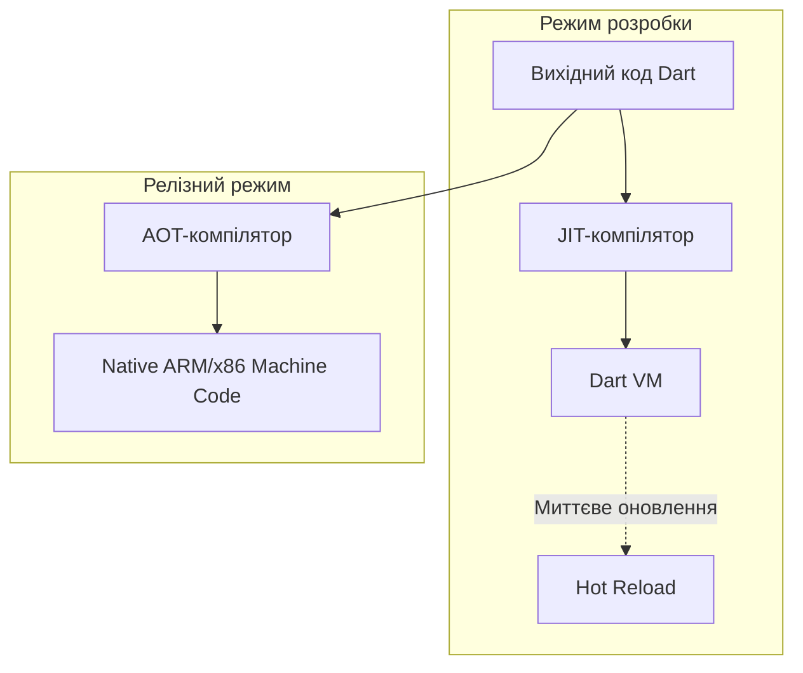

**Варіант 5:** Чому саме Dart  
**Мета:** Обгрунтувати вибір мови Dart для Flutter технічними аргументами, показати роботу JIT/AOT компіляції, ізолятів та збирача сміття.

## 1. JIT та AOT-компіляція: роль у циклі розробки

Мова Dart ефективна тим, що повноцінно підтримує два режими компіляції, кожен з яких ідеально закриває специфічні потреби життєвого циклу застосунку.

*   **JIT компіляція:** Використовується під час розробки. Код компілюється безпосередньо під час виконання у Dart VM, це дозволяє миттєво застосовувати зміни без перекомпіляції всього проєкту, що прискорює розробку та етапи UI.
*   **AOT компіляція:** Використовується для релізних збірок. Код заздалегідь компілюється в нативний машинний код (ARM або x86). Це гарантує швидкий запуск застосунку та стабільну продуктивність (близько 60-120 кадрів на секунду), оскільки усуває затримки на компіляцію на ходу.

Відповідно до офіційної документації Dart, Dart Native включає як Dart VM з JIT-компіляцією, так і AOT-компілятор для створення машинного коду.

## 2. Як Hot Reload зберігає стан застосунку
Головна перевага JIT у Dart - це здатність ін'єктувати нові версії функцій та класів у віртуальну машину, не знищуючи при цьому об'єкти, які вже існують у пам'яті.

## 3. Модель Ізолятів та усунення помилок багатопотоковості
У Dart немає традиційних потоків зі спільною пам'яттю. Замість цього використовуються Ізоляти.
Кожен ізолят має власний цикл подій та власну ізольовану ділянку пам'яті.
Ізоляти спілкуються між собою виключно шляхом передачі повідомлень.

Чому це усуває помилки: Оскільки два ізоляти ніколи не мають доступу до однієї і тієї ж комірки пам'яті одночасно, технічно неможливо створити стан переслідуванняабо взаємне блокування, що є найпоширенішими проблемами класичної багатопотоковості.

## 4. Збирач сміття і конвеєр кадру
Архітектура Flutter передбачає, що дерево віджетів є імутабельним. При кожній зміні стану Flutter створює сотні, або більше нових об'єктів для побудови нового кадру, а старі відкидає.
Dart має генераційний збирач сміття, який ідеально підходить для Nursery: Нові віджети виділяються за допомогою надшвидкого алгоритму bump pointer
Оскільки в більшості віджетів лише один кадр (16 мс), вони миттєво стають сміттям.
Фаза очищення Nursery виконується надзвичайно швидко, копіюючи лише кілька об'єктів, що вижили, і скидаючи весь простір. Це не викликає пропусків кадрів.

## 5. Альтернативна мова та її недоліки
Мова-альтернатива: Swift (використовується в розробці iOS).
Якої властивості бракує:
1) Повноцінного збереження стану при Hot Reload на базі JIT. У Swift немає вбудованої віртуальної машини з підтримкою JIT, яка дозволяла б робити підмін коду за мілісекунди зі стовідсотковим збереженням контексту під час роботи складної логіки.
2) Швидкої розподілу менш живучих об'єктів. Swift використовує ARC. Створення та знищення тисяч маложивучих об'єктів щокадру в ARC вимагало б постійного оновлення лічильників посилань, що створювало б суттєве навантаження на процесор, на відміну від швидкого скидання Nursery-пам'яті в Dart.

## 6. Висновок
Під час дослідження я зрозумів, що обирають Dart для Flutter не випадково. Архітектура Flutter була б фатально повільною у багатьох інших мовах програмування, але команди Dart та Flutter тісно співпрацювали, щоб оптимізувати віртуальну машину та збирач сміття спеціально під патерни виділення пам'яті у Flutter. Тобто фреймворк і мова еволюціонували разом, щоб забезпечити компроміс між Developer Experience  та нативною швидкістю рендерингу.

## 7. Джерела
1) https://dart.dev/overview#platform
2) https://dart.dev/language/concurrency
3) https://docs.flutter.dev/tools/devtools/memory
